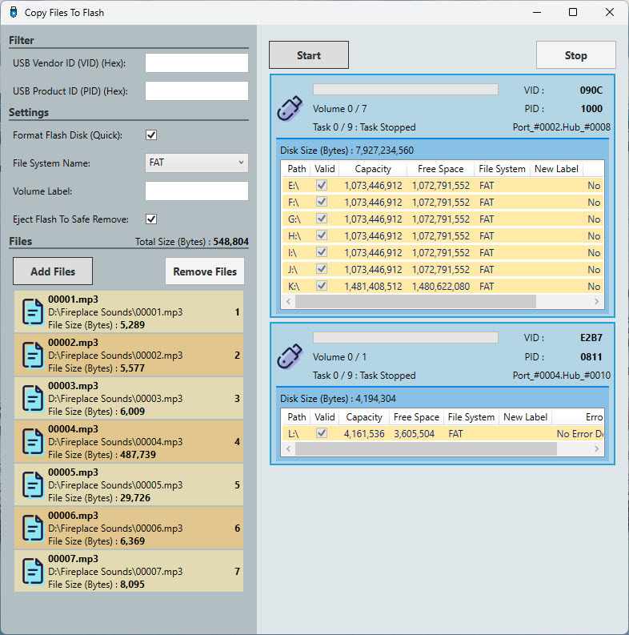

# Copy Files To Flash

This application allows users to batch copy selected files to a USB flash drive in sequence. It includes several features and settings to facilitate and customize the copying process.

## Features

- **USB Device Filtering:** Filter USB devices based on VID (Vendor ID) and PID (Product ID).
- **Formatting Options:** Configure settings to format the flash drive, change its file system format, modify the volume label, and eject the flash drive after copying completes.
- **File Management:** 
  - **Add Files:** Users can add files to the list using the 'Add' button.
  - **Remove Files:** Users can remove files from the list using the 'Remove' button.
  - **File List Display:** A list box displays all selected files with details, and the total size of the selected files is shown.
- **Copy Control:**
  - **Start/Stop Buttons:** Start and stop the copying process with the 'Start' and 'Stop' buttons located in the right panel.
- **USB Drive Monitoring:**
  - A list box at the bottom of the right panel displays all connected USB flash drives and their volumes.
  - Errors during the copying process are highlighted in red within this list box.

## Requirements

- .Net Core 8.0
- Windows Desktop

## Installation

To install this application, clone the repository and build the solution using Visual Studio.

```bash
git clone https://github.com/bakhshipoor/USBDevices.git
cd USBDevices/CopyFilesToFlash
```

## Usage

1. **Launch the Application:** Open the CopyFilesToFlash project in Visual Studio and run the application.
2. **Filter USB Devices:** 
   - Enter the VID and PID for the USB devices you want to filter.
3. **Configure Settings:**
   - Select options to format the flash drive, change the file system format, modify the volume label, and choose whether to eject the flash drive after copying.
4. **Manage Files:**
   - Use the 'Add' button to select and add files to the list.
   - Use the 'Remove' button to delete files from the list.
5. **Start Copying:**
   - Click the 'Start' button to begin the copying process.
   - Monitor the copying process in the right panel. Any errors will be displayed in red.
6. **Stop Copying:**
   - Click the 'Stop' button to halt the copying process at any time.

## Screenshots


*Main Interface showing file management and USB device monitoring.*


*Settings Panel for configuring format and other options.*

## License

This project is licensed under the MIT License. See the [LICENSE](LICENSE.txt) file for details.

## Contributing

Contributions are welcome! Please fork the repository and submit a pull request.

## Acknowledgements

Thanks to all contributors and supporters.

---

Feel free to check the repository at [CopyFilesToFlash](https://github.com/bakhshipoor/USBDevices/tree/master/CopyFilesToFlash).
