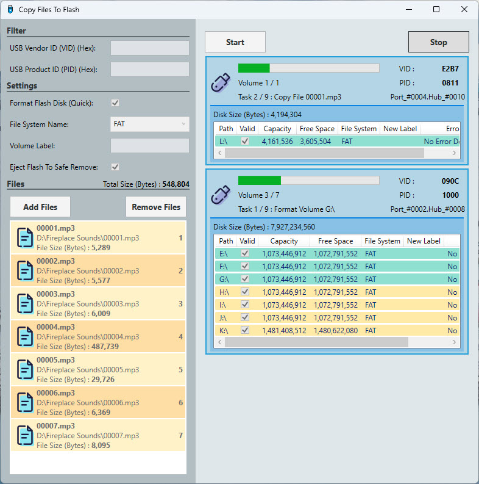

# Copy Files To Flash

This application allows users to batch copy selected files to a USB flash drive in sequence. It includes several features and settings to facilitate and customize the copying process.

## Features

- **USB Device Filtering:** Filter USB devices based on VID (Vendor ID) and PID (Product ID).
- **Formatting Options:** Configure settings to format the flash drive, change its file system format, modify the volume label, and eject the flash drive after copying completes.
- **File Management:** 
  - **Add Files:** Users can add files to the list using the 'Add' button.
  - **Remove Files:** Users can remove files from the list using the 'Remove' button.
  - **File List Display:** A list box displays all selected files with details, and the total size of the selected files is shown.
- **Copy Control:**
  - **Start/Stop Buttons:** Start and stop the copying process with the 'Start' and 'Stop' buttons located in the right panel.
- **USB Drive Monitoring:**
  - A list box at the bottom of the right panel displays all connected USB flash drives and their volumes.
  - Errors during the copying process are highlighted in red within this list box.

## Requirements

- .Net Core 8.0
- Windows Desktop

## Installation

To install this application, clone the repository and build the solution using Visual Studio.

```bash
git clone https://github.com/bakhshipoor/USBDevices.git
cd USBDevices/CopyFilesToFlash
```

## Usage

1. **Launch the Application:** Open the CopyFilesToFlash project in Visual Studio and run the application.

2. **Filter USB Devices:** 
   - Enter the VID (Vendor ID) and PID (Product ID) for the USB devices you want to filter in the Filter section.

3. **Configure Settings:**
   - **Format Flash Disk (Quick):** Check this option to format the flash disk quickly.
   - **File System Name:** Select the desired file system format (e.g., FAT) from the dropdown menu.
   - **Volume Label:** Enter a new label for the volume.
   - **Eject Flash To Safe Remove:** Check this option to eject the flash disk safely after the copying process is complete.

4. **Manage Files:**
   - Use the **Add Files** button to select and add files to the list.
   - Use the **Remove Files** button to delete files from the list.
   - The list box displays all selected files with their paths, sizes, and details. The total size of all selected files is shown at the top of the list.

5. **Start Copying:**
   - Click the **Start** button to begin the copying process.
   - The right panel displays the connected USB flash drives and their volumes, showing details such as path, capacity, free space, file system, new label, and any errors.

6. **Stop Copying:**
   - Click the **Stop** button to halt the copying process at any time.

## User Interface Breakdown

### Filter Section
- **USB Vendor ID (VID) (Hex):** Input field for the USB vendor ID in hexadecimal.
- **USB Product ID (PID) (Hex):** Input field for the USB product ID in hexadecimal.

### Settings Section
- **Format Flash Disk (Quick):** Checkbox for quickly formatting the flash disk.
- **File System Name:** Dropdown menu to select the file system format (e.g., FAT, NTFS).
- **Volume Label:** Input field for setting the new volume label.
- **Eject Flash To Safe Remove:** Checkbox to eject the flash disk safely after copying.

### Files Section
- **Add Files:** Button to add files to the list.
- **Remove Files:** Button to remove selected files from the list.
- **File List Display:** 
  - Displays added files with their paths and sizes.
  - Shows the total size of all selected files at the top.

### Right Panel
- **Start Button:** Begins the file copying process.
- **Stop Button:** Stops the file copying process.
- **USB Drives List:** 
  - Displays all connected USB flash drives and their volumes.
  - Shows details such as VID, PID, path, capacity, free space, file system, new label, and errors.
  - Errors are highlighted in red for easy identification.

### Status and Progress
- **Task Status:** Displays the number of tasks and their statuses.
- **Error Handling:** Errors encountered during the copying process are displayed in red within the USB drives list.

## Screenshots


*Main Interface before statr.*




*Main Interface after statr.*

## License

This project is licensed under the MIT License. See the [LICENSE](LICENSE.txt) file for details.

## Contributing

Contributions are welcome! Please fork the repository and submit a pull request.

## Acknowledgements

Thanks to all contributors and supporters.

---

Feel free to check the repository at [CopyFilesToFlash](https://github.com/bakhshipoor/USBDevices/tree/master/CopyFilesToFlash).
